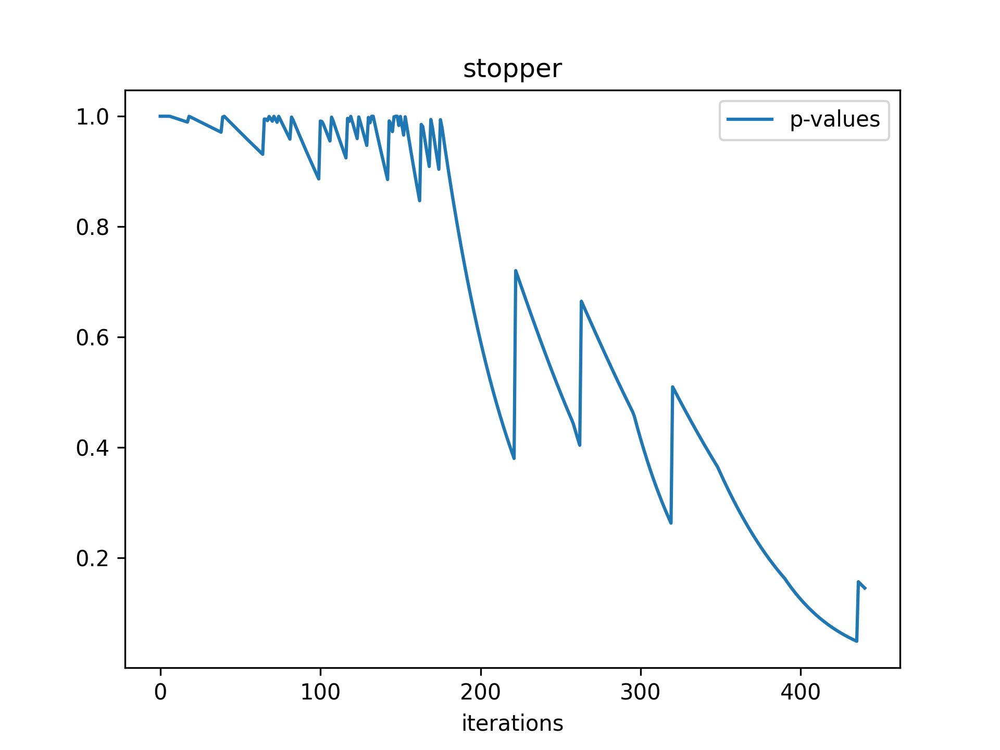
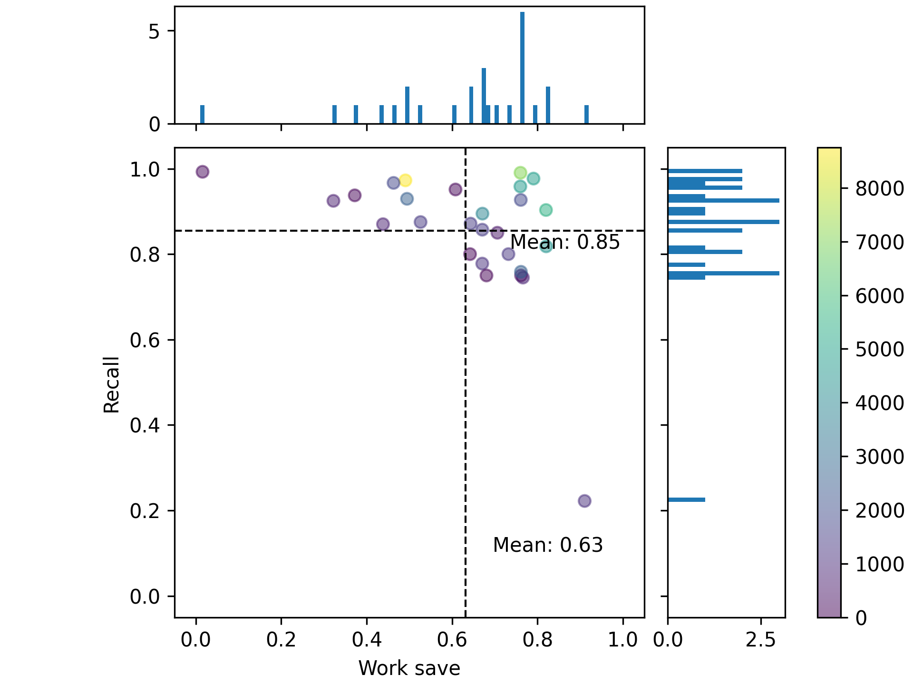
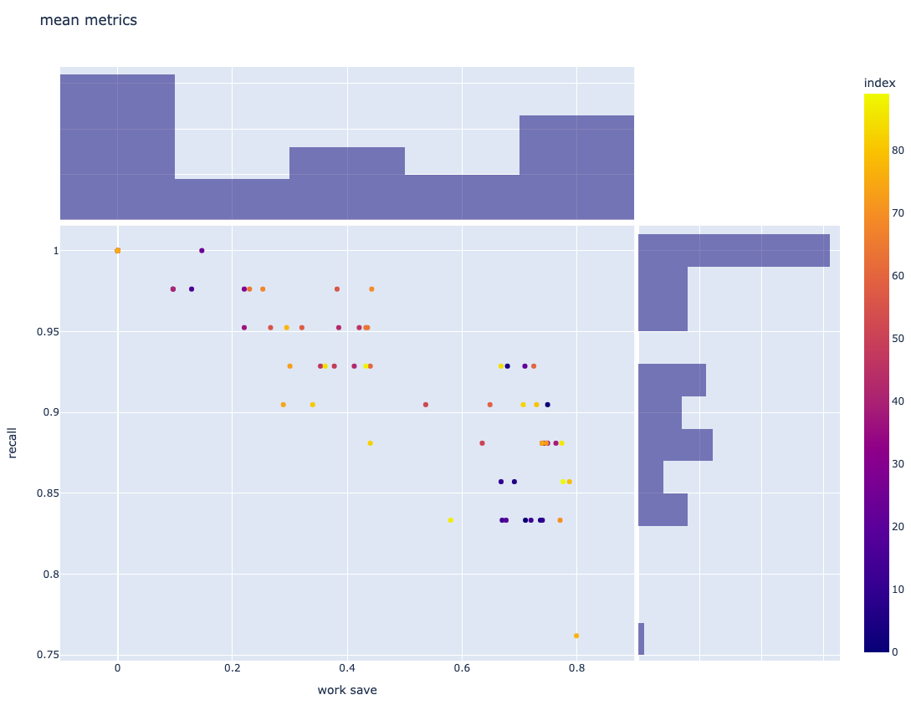

# Simulator for Active Learning
Intended to assist the Living Knowledge project, this simulator performs systematic review labelling using an Active Learning approach. Various algorithms and methods can be implemented and their efficacy evaluated with respect to different datasets.


## Using the simulator
Ensure datasets are present in the desired working directory and in the correct [format](#compatible-datasets)

### Running simulation with command line arguments
Install dependencies from requirements.txt file:
```commandline
pip install -r requirements.txt
```

Execute the simulate.py program
Example command line instruction:
```commandline
python simulate.py configs_directory
```
- ```configs_directory```  specify the directory / compressed file containing all configs files to be used

### Running simulation from bash script
Support for multiprocessing using bash, see example [here](test.sh).

To collate results from different experiments together, run the [collate_experiments](collate_experiments.py) program as follows:
```commandline
python collate_experiments.py experiments_directory output_file_name
```
- ```experiments_directory``` contains each experiment's output (each execution of the program)
- ```output_file_name``` specifies the (shared) name of the desired json metrics, default "overall.json"

## Config file keys

---
### *```DATA:```*
Parameters for selecting the desired training datasets.

|  name  | description                             | options             | optional parameters              |
|:------:|-----------------------------------------|---------------------|----------------------------------|
| `data` | specify the name of the datasets folder | (dataset directory) | (int) number of datasets to test |
---
### *```FEATURE EXTRACTION:```*
Parameters for feature extraction if required by the dataset.

|     name     | description                       | Current (corresponding) options |
|:------------:|-----------------------------------|---------------------------------|
|   `module`   | name of the module (python file)  | tfidf                           |
|   `class`    | name of the class to instantiate  | TFIDF                           |
| `parameters` | optional parameters for the class | (int) number of features        |
---
### *```MODEL, SELECTOR, STOPPER:```*
Parameters common to the model, selector, and stopper config keys.

|     name     | description                       | Model current (corresponding) options                                                                                                    | Selector current (corresponding) options                                                                                      | Stopper current (corresponding) options                                                                                 |
|:------------:|-----------------------------------|------------------------------------------------------------------------------------------------------------------------------------------|-------------------------------------------------------------------------------------------------------------------------------|-------------------------------------------------------------------------------------------------------------------------|
|   `module`   | name of the module (python file)  | model_algorithms.NB  <br /> model_algorithms.LR  <br /> model_algorithms.SVC  <br /> model_algorithms.MLP  <br /> model_algorithms.Ideal | selector_algorithms.highest_confidence  <br /> selector_algorithms.lowest_entropy  <br /> selector_algorithms.weighted_sample | stopper_algorithms.consecutive_count  <br /> stopper_algorithms.sample_proportion <br /> stopper_algorithms.statistical |
|   `class`    | name of the class to instantiate  | NB  <br /> LR <br /> SVC <br /> MLP <br /> IDEAL                                                                                         | HighestConfidence <br /> LowestEntropy <br /> WeightedSample                                                                  | ConsecutiveCount <br /> SampleProportion <br /> Statistical                                                             |
| `parameters` | optional parameters for the class | -                                                                                                                                        | -                                                                                                                             | - <br /> - <br /> (float) alpha                                                                                         |
---
### *```TRAINING:```*
Parameters that adjust the training performance or verbosity.

|        name        | description                                           | options                                                                            |
|:------------------:|-------------------------------------------------------|------------------------------------------------------------------------------------|
| `batch proportion` | decimal percentage of the dataset to sample at a time | (float)                                                                            |
|    `confidence`    | level of recall confidence required                   | (float)                                                                            |
|     `verbose`      | the subsystems to produce a verbose output            | *any number of:* <br /> model <br /> selector <br /> stopper <br /> active_learner |
---
### *```OUTPUT:```*
Output location and metric specifications.

|       name       | description                                      | options                                                                                                                                                                                                                                         |
|:----------------:|--------------------------------------------------|-------------------------------------------------------------------------------------------------------------------------------------------------------------------------------------------------------------------------------------------------|
|  `output path`   | output directory location                        | (directory)                                                                                                                                                                                                                                     |
| `output metrics` | list of metrics names to visualise               | *any number of:* <br /> documents_sampled <br /> relevants_sampled <br /> documents_seen <br /> relevants_seen <br /> true_recall <br /> true_work_save <br /> model_recall <br /> screened_indices <br /> model <br /> selector <br /> stopper |
---

### Config example

```yaml
# .yml
DATA:
  - data: data 11

FEATURE EXTRACTION:
  - module: tfidf
  - class: TFIDF
  - parameters: 1000

MODEL:
  - module: model_algorithms.NB
  - class: NB
  - parameters:

SELECTOR:
  - module: selector_algorithms.highest_confidence
  - class: HighestConfidence
  - parameters:

STOPPER:
  - module: stopper_algorithms.statistical
  - class: Statistical
  - parameters: 0.9

TRAINING:
  - batch proportion: 0.03
  - confidence: 0.95
  - verbose: selector_algorithms stopper

OUTPUT:
  - output path: demo/demo_ouputs
  - output metrics: true_recall model_recall stopper selector model
```

Configuration files can be also generated en masse by editing and executing the ```config.py``` ```create_configs_combinations()``` function:
```commandline
python config.py output_directory
```


## Dependencies
Install dependencies from the provided requirements.txt file:
```commandline
pip install -r requirements.txt
```
Core dependencies:
- [Python v3.8.8](https://a2i2.atlassian.net/wiki/spaces/ENG/pages/199196673/Tech+Stack+Installation+Recommendations#Missing)
- [pip3](https://a2i2.atlassian.net/wiki/spaces/ENG/pages/199196673/Tech+Stack+Installation+Recommendations#Missing)
- numpy
- pyyaml
- tqdm
- pandas
- nltk
- scipy
- scikit-learn
- plotly
- pillow
- matplotlib


## Implementing algorithms
Algorithms for the ML model, selector, and stopper can be included for experiments by creating a class 
using the [model](model_algorithms/model.py), [selector](selector_algorithms/selector.py), [stopper](stopper_algorithms/stopper.py) abstract classes.

Annotated example templates of implementations can be found here: [model example](model_algorithms/model_template.py) | [selector example](selector_algorithms/selector_template.py) | [stopper example](stopper_algorithms/stopper_template.py)

Refer to class specification sections [below](#al-model-framework) for descriptions of required methods / attributes. 


## Outputs
A full precomputed output can be found [here](https://doi.org/10.6084/m9.figshare.22091339).

Simulation was conducted with 120 different configurations of hyper-parameters and algorithms (these configurations are also included).
Note: it was executed a single config at a time for multiprocessing: 
the results of each execution were collated together separately (see the [bash script execution](#running-simulation-from-bash-script) section for details).


### Training metrics
Metrics stored during training of each dataset:
- ```documents_sampled```: number of documents sampled each iteration
- ```relevants_sampled```: number of relevant documents sampled each iteration
- ```documents_seen```: number of total documents seen during training
- ```relevants_seen```: number of total relevant documents seen during training
- ```true_recall```: true  [recall](#config-metrics) values each iteration of training
- ```true_work_save```: true [work save](#config-metrics) values each iteration of training
- ```model_recall```: model prediction [recall](#config-metrics) over the entire dataset each iteration of training
- ```screened_indices```: ordered indices of the documents that were chosen for screening throughout training

Metrics are stored with the following format:
``` python
metric = {'name': plot_name, 'x': (x_label, x_values), 'y': (y_label, y_values)}
```

Example metric visualisation:



### Config metrics
Metrics for evaluating the performance of a configuration:
- ```recall```: ratio of relevant documents screened to total relevant documents
- ```work save```: ratio of un-screened documents to total documents

Example config visualisation (also available as interactive .html):



- each point corresponds to a dataset
- colours represent the number of documents in the dataset


### Config comparison
Metrics for comparing configurations
- ```mean_recall```: average [recall](#config-metrics) for a configuration over all datasets
- ```min_recall```: worst [recall](#config-metrics) for a configuration over all datasets
- ```mean_work_save```: average [work save](#config-metrics) for a configuration over all datasets
- ```min_work_save```: worst [work save](#config-metrics) for a configuration over all datasets

Example config comparison visualisation (interactive html):



- each point corresponds to a configuration 
- colour represents to index of the configuration file in the list of configurations
- interactive plot: can hover over points for the configuration name, metric values


## Data handling

### Compatible datasets
Systematic review datasets obtained from:
https://github.com/asreview/systematic-review-datasets

Currently supported formats:
- raw CSV data with columns ```'record_id'```, ```'title'```, ```'abstract'```, ```'label_included'```
- 'title' and 'abstract' are used as the raw features in new column named 'x'
- 'label_included' specifies whether an instance is *irrelevant* (class 0) or *relevant* (class 1)

Data loading:
- extracts ```.csv``` datasets from compressed ```.zip```
- can also load precomputed TF-IDF ```.pkl``` datasets


### Data preparation
Data cleaning:
- removal of English stopwords
- removal of punctuation
- removal of repeated characters (maybe not necessary for academic literature?)
- removal of miscellaneous artifacts such as URLs, numerics, email addresses etc.

Tokenisation, stemming and lemmatisation:
- reduces word variations by only considering root lexemes

### Feature extraction using [TF-IDF](./tfidf.py)
Creates a TF-IDF vectoriser to extract features from the raw data. 


## AL model framework


### [Machine learning algorithm](model_algorithms/model.py)
Provides base functionality training and testing for Active Learning sample selection.

Each model should include the following methods:
- ```train```: train model from training data
- ```test```: test model on testing data and output scores (e.g. probabilities) for both classes *irrelevant* and *relevant*
- ```predict```: outputs the class predictions for testing data, i.e. *irrelevant* (class 0) or *relevant* (class 1)

Optional methods:
- ```get_eval_metrics```: optionally return a list of [metrics](#training-metrics) for evaluation and visualisation


### [Active learning sample selection](selector_algorithms/selector.py)
Selector object handles the selection of sample instances during Active Learning.

Each selector should include the following methods:
- ```initial_select```: provides implementation for the initial sampling to initialise the machine learning model. Typically, this is done through random sampling
- ```select```: selects samples from the machine learning predictions during AL testing

Optional methods:
- ```get_eval_metrics```: optionally return a list of [metrics](#training-metrics) for evaluation and visualisation

Currently supported machine learning models include:
- Highest confidence selector: selects the instances that most confidently suggest a relevant document
- Lowest entropy selector: chooses instances that show the lowest entropy (most confident predictions)
- Weighted highest confidence selector: gives higher weightings (probability for selection) to instances with higher prediction scores for relevancy


### [Active learning stopping criteria](stopper_algorithms/stopper.py)
Stopper object handles the early stopping of Active Learning.

Each stopper should include the following methods:
- ```initialise```: this is run during the initial sampling before ML training. As such, it may be called several times if (random) sampling did not produce desirable class distributions
- ```stopping_criteria```: determines whether Active Learning should be continued or stopped early byt setting ```self.stop = True```. This is called each iteration of the main AL training loop, i.e. after selection of a sample batch and ML training / testing. Set to ```self.stop = -1``` to exit active learning and enter random sampling

Optional methods:
- ```get_eval_metrics```: optionally return a list of [metrics](#training-metrics) for evaluation and visualisation

Currently supported stopping criteria algorithms include:
- Sample size: stops AL when the sample no longer contains relevant documents (naive)
- Sample proportion: measures the class distribution from random sampling and determines an estimate for the total number of relevant documents in the dataset. When this value is reached by the active learner, AL training terminates
- Recall estimate statistical analysis: uses hypergeometric sampling to determine a p-value as the stopping criteria. Terminates AL when the target recall has likely been reached


### [Active learning handler](./active_learner.py)
Handles the AL training loops for systematic review labelling. Training involves initialisation of parameters, initial sampling using the chosen selector's *initial_select* method, main AL training loop using the chosen ML model's predictions and chosen selector's *select* method under the chosen stopper's *stopping_criteria*.

Produces a mask representing the items (indices) in the dataset that were trained, and a mask representing the instances that were found to be relevant.

### [Evaluator](./evaluator.py)
Stores metrics and facilitates results outputting / visualisations.